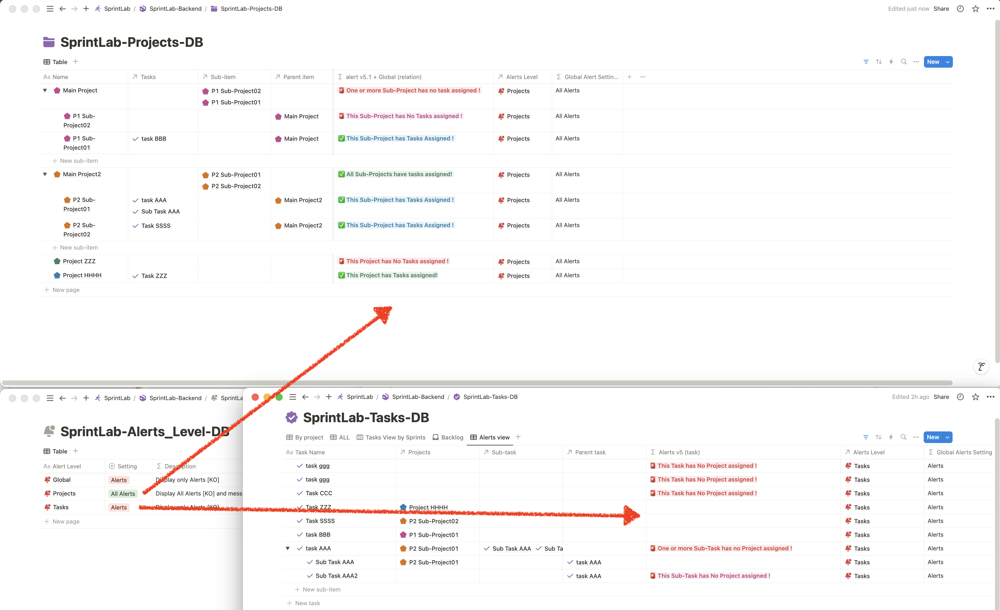

# Alerts for Items & Sub-items

When Sub-items are activated in a Database, here Projects with Sub-projects,
Display alerts if a Project or Sub-project does not have a task assigned.

With differents Alerts:
→ for Projects with no Sub-projects and no assigned Tasks
→ for Projects with Subprojects and where at least one Subproject does not have an assigned Task.

→→ And Display separate messages: 
- In the ‘Parent’ Project
- Project and in the Sub-Project(s) that has no assigned task.

### Latest Version:

**Database Relationship Alert :**

- No need to edit the formula by hand
- Define an Alert Level (rather than on a case-by-case basis):
	- Either a level specific to each DB, 
	- or a Global alert level.

Messages are declared as variables (easier to edit according to your wishes) for greater clarity.

### Exemple Preview

