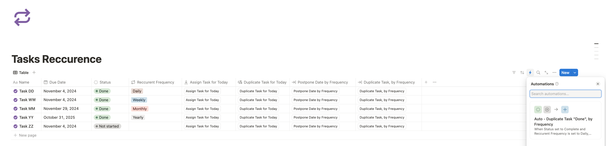
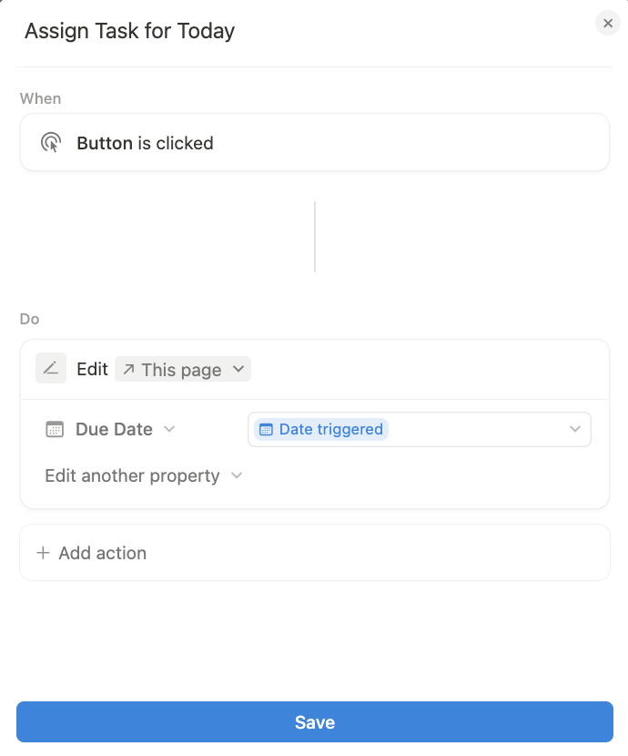
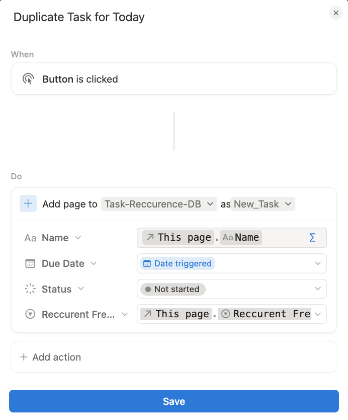
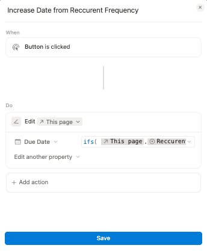
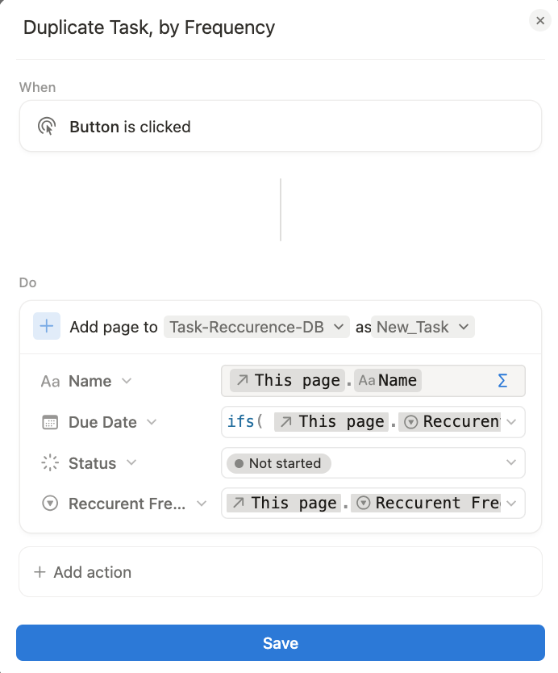
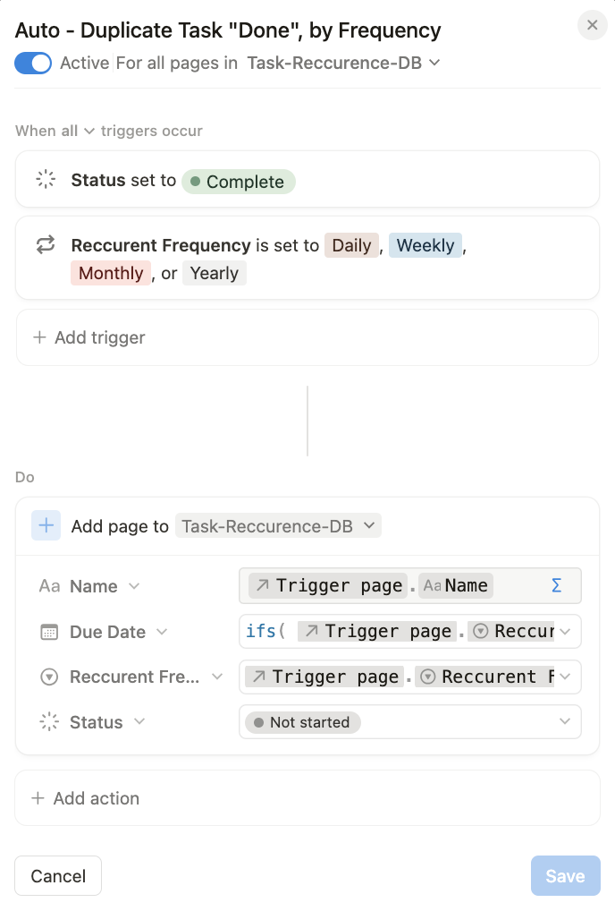

# Recurring tasks (without using a template)

I wanted to be able to assign a task to ‘today’ in 1-Click, without having to edit the page or do more than... 1-Click.

I also wanted to be able to duplicate a task according to a given frequency (days, weeks, months, years).

Use case:

I'm doing a task, and I know I should continue it tomorrow or over several days, I want to be able to duplicate it - and not move it - and without having to create a Template.

But I also want to move a task (that I haven't done today, for example) to tomorrow, or according to the frequency in question.

And finally, if I have tasks with a declared frequency, I want it to be duplicated when the task is ‘Done’, with the Status ‘Not Started’ and the next day or according to the declared frequency.

And eventually duplicate a Task Manually, Roughly speaking, this is the same result as automation but in manual mode or the same as Postpone, but instead of editing the page, we duplicate the page in the DB.

There are many possible variations, it's up to you to adapt.

## Button - Assign Task for Today

No formulas needed.

## Button - Duplicate Task for Today

No formulas needed:

## Button - Postpone Date, by Frequency

[Formula: PostponeDateByFrequency.notion](./PostponeDateByFrequency.notion)

## Button - Duplicate Task, by Frequency

[Formula: DuplicateTaskByFrequency.notion](./DuplicateTaskByFrequency.notion):

## Automation - Duplicate Task "Done", by Frequency

[Formula: Automation-DuplicateTaskDoneByFrequency.notion](./Automation-DuplicateTaskDoneByFrequency.notion)

